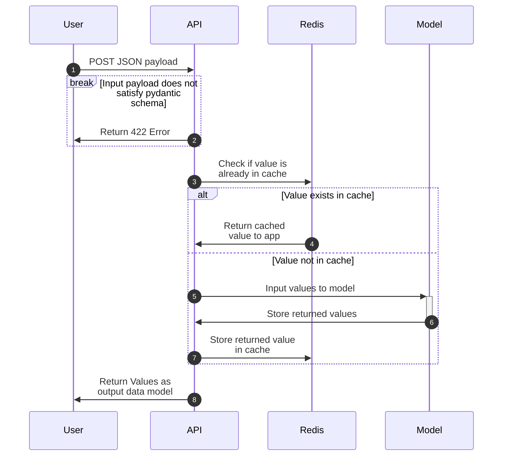
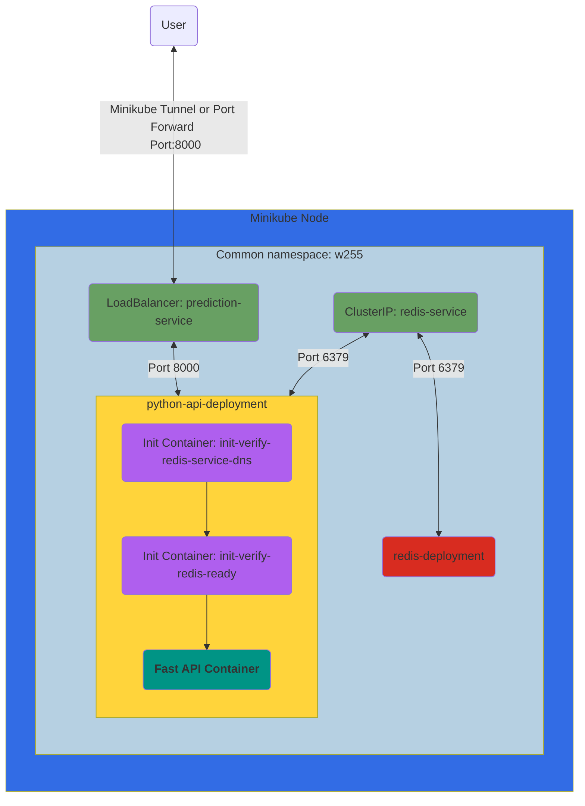
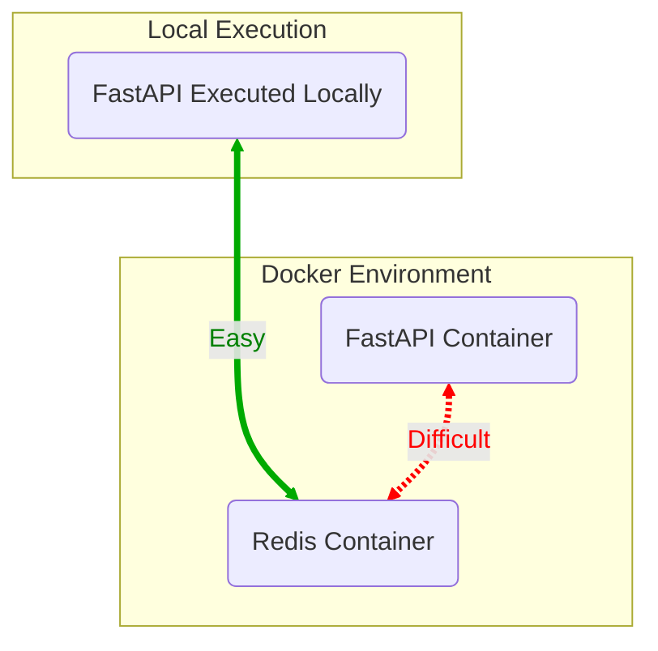

# Lab 3: Caching and Kubernetes

<p align="center">
    <!--FAST API-->
        
    <!--PLUS SIGN-->
        
    <!--REDIS LOGO-->
        
    <!--PLUS SIGN-->
        
    <!--KUBERNETES-->
        
</p>

- [Lab 3: Caching and Kubernetes](#lab-3-caching-and-kubernetes)
  - [Lab Overview](#lab-overview)
  - [How to approach this lab](#how-to-approach-this-lab)
  - [Lab Objectives](#lab-objectives)
    - [API Requirements](#api-requirements)
    - [Deployment Requirements](#deployment-requirements)
    - [Documentation Requirements](#documentation-requirements)
    - [Lab Setup](#lab-setup)
    - [Expected Final Folder Structure](#expected-final-folder-structure)
    - [Grading Script](#grading-script)
  - [Helpful Tips](#helpful-tips)
    - [API Diagram](#api-diagram)
    - [Deployment Diagram](#deployment-diagram)
    - [Redis Expectations](#redis-expectations)
      - [Dependency Adding](#dependency-adding)
      - [How to use `fastapi-cache2`](#how-to-use-fastapi-cache2)
      - [Connecting to Redis in Code](#connecting-to-redis-in-code)
      - [Running Redis Locally](#running-redis-locally)
      - [Running Redis in Kubernetes](#running-redis-in-kubernetes)
      - [Making Code Reusable When Developing](#making-code-reusable-when-developing)
      - [Creating Valid Pytests](#creating-valid-pytests)
      - [Verifying your Redis deployment](#verifying-your-redis-deployment)
      - [Redis Deployment](#redis-deployment)
    - [Input Vectorization](#input-vectorization)
    - [Pytest, FastAPI, and Lifespan Events](#pytest-fastapi-and-lifespan-events)
    - [Kubectl and minikube](#kubectl-and-minikube)
    - [Networking Requirements](#networking-requirements)
    - [Docker Daemons](#docker-daemons)
    - [Specialized Containers: Init + Readiness + Liveness](#specialized-containers-init--readiness--liveness)
      - [Init Containers](#init-containers)
      - [Startup Probe](#startup-probe)
      - [Readiness Probe](#readiness-probe)
      - [Liveness Probe](#liveness-probe)
  - [Grading](#grading)
  - [Time Expectations](#time-expectations)

## Lab Overview

The goal of `lab3` is to extend your `FastAPI` application from `lab2` with the following:

- Your API takes a *list* of inputs to predict instead of a single input.
- Your API will have a rudimentary Redis cache for the new `/bulk-predict` endpoint based on the inputs.
- Your application deploys locally on a Kubernetes environment (Minikube).

## How to approach this lab

We have done our best to organize this lab top-down to direct your order of operations best. Focus on doing all the [API Requirements](#api-requirements) first, then work on [Deployment Requirements](#deployment-requirements). Start early, read all the hints we have given, and ask questions on slack.

> [!IMPORTANT]
> The Automatic feedback system via github actions is a shared resource across the class. The system runs smoothest with on-time submissions. Later submissions can experience delays due to increased load on the automated feedback system.

---

## Lab Objectives

### API Requirements

- [x] All requirements from `lab2`
- [ ] Ensure the model is loaded only when the container is instantiated/started (i.e., not every time you run a prediction)
- [ ] Create a new request model which extends your single input model to accept a list of inputs instead of a single input.
  - Use `houses` as the field name which expects a list of the input objects you designed in lab2
- [ ] Create a response model returning a `list` of floats
- [ ] Create a new `POST` endpoint `/bulk-predict` which takes a `List` of inputs based on the request model you created above
  - You must utilize the `multi_predict` function we have defined for you in the template
  - Add the decorator key to this defined function
- [ ] Run your predictions on a matrix input instead of row by row. (See [Input Vectorization](#input-vectorization) for our expectations)
- [x] Utilize the prefix of `w255-cache-prediction` for all Redis keys
- [ ] Cache the entire input sent to `/predict` to Redis (See [Redis Expectations](#redis-expectations) for our expectations)
- [ ] Cache the entire input sent to `/bulk-predict` to Redis (See [Redis Expectations](#redis-expectations) for our expectations)
- [ ] Update your tests from `lab2` to give list inputs to your new endpoint

> [!Caution]
> DO NOT PROCEED UNTIL YOU HAVE FINISHED ALL API REQUIREMENTS

### Deployment Requirements

- [ ] Deploy your application to Kubernetes locally (Minikube)
  - [ ] (`namespace.yaml`) Deploy all components to a non-default `namespace` called `w255`
  - [ ] (`deployment-redis.yaml`) Deployment for Redis in `w255` namespace
    - See [Redis Expectations](#redis-expectations) for more details and requirements
  - [ ] (`deployment-pythonapi.yaml`) Deployment for your API in `w255` namespace
    - [ ] Your API deployment (`deplyoment-pythonapi.yaml`) should include an `initContainer`, `readinessProbe`, `livenessProbe`, and `startupProbe`
      - Init Containers:
        - [ ] Create an `initContainer` named `init-verify-redis-service-dns` should wait for the Redis DNS to become available
        - [ ] Create an `initContainer` named `init-verify-redis-ready` should wait for the Redis Service to become available
      - [ ] `readinessProbe` should wait for the API to be locally available by using the `/health` endpoint
      - [ ] `livenessProbe` should monitor whether the API is responsive by using the `/health` endpoint
      - [ ] `startupProbe` should wait for the API to be locally available by using the `/health` endpoint
    - [ ] Your API deployment should have `3` replicas
  - [ ] (`service-redis.yaml`) Service for Redis in `w255` namespace
  - [ ] (`service-prediction.yaml`) Service for API in `w255` namespace
    - It should be a [LoadBalancer](https://kubernetes.io/docs/concepts/services-networking/service/#loadbalancer) type

> [!NOTE]
> When we run the autograder, we will name your docker container `lab3`. This has implications on the YAML files you will be writing.

### Documentation Requirements

- [ ] Use the `README.md` file generated in the `lab3` folder to document how to build, run, and test code
- [ ] Answer several short answer questions (2-3 sentences) to help solidify your understanding of this lab. There is a prompt for the questions in `SHORT-ANSWERS.md`

### Lab Setup

Copy your code from lab 2 into a new lab folder `lab3`. You will use the same model you trained in `lab3`

Install `minikube` ([Docs](https://minikube.sigs.k8s.io/docs/start/))

Change Kubernetes version to match what we will deploy into Azure Kubernetes Service (AKS) for future labs and projects, `1.27.3`.

`minikube start --kubernetes-version=v1.27.3`

### Expected Final Folder Structure

```{text}
.
├── .github
│   └── autogenerated_files_do_not_worry/
├── README.md
├── SHORT-ANSWER.md
└── lab3-Caching-and-Kubernetes
    ├── Dockerfile
    ├── README.md
    ├── model_pipeline.pkl
    ├── poetry.lock
    ├── pyproject.toml
    ├── infra
    │   ├── deployment-pythonapi.yaml
    │   ├── deployment-redis.yaml
    │   ├── namespace.yaml
    │   ├── service-prediction.yaml
    │   └── service-redis.yaml
    ├── src
    │   ├── __init__.py
    │   ├── housing_predict.py
    │   └── main.py
    ├── tests
    │   ├── __init__.py
    │   ├── conftest.py
    │   └── test_src.py
    └── trainer
        ├── predict.py
        └── train.py
```

### Grading Script

Most of your work for this lab will be coordinating your Kubernetes deployment.

We will test your system in the following way; consider emulating the following steps to verify

1. Start up Minikube
1. Setup your docker daemon to build with Minikube (See [Docker Daemons](#docker-daemons))
1. Ensure your API model is trained. Run the training script if needed
1. Build the docker container of your application
1. Apply your k8s namespace
1. Apply your Deployments and Services
1. (if you choose to use `minikube tunnel` ) Create a separate `minikube tunnel` process and record the PID of that process **OR** `port-forward` a local port on your machine to your API service
1. Wait for your API to be accessible
   - This is a separate check from your init containers and other health checks.
   - This should run to make sure your API is accessible/ready from your run script
1. Validate all Lab 1/2 Endpoints
1. Validate all Lab 3 Endpoints
1. Validate the cache is properly recording values
1. Clean up after yourself
   - (if you used `minikube tunnel`) kill the `minikube tunnel` process you ran earlier
   - delete all resources in the `w255` namespace
   - delete the `w255` namespace
   - stop Minikube

> [!IMPORTANT]
> We provide the autograder as a form of automated feedback. After your submission, we will add additional tests to the autograder, which ensure the veracity of your solution; the requirements will not change but will ensure that you follow the requirements presented in this readme.
> For example, the autograder prior to submission deadline will not verify if your caching system is successful, but this will be tested for after the deadline

---

## Helpful Tips

### API Diagram

The following is a visualization of the sequence diagram describing our new API



### Deployment Diagram

The following is a visualization of the infrastructure you should implement for Lab 3.



### Redis Expectations

#### Dependency Adding

In this lab, we will utilize a naive approach to caching to protect you from repeated messages.
You are expected to use [`fastapi-cache2`](https://github.com/long2ice/fastapi-cache) library that handles a lot of things for you.
Add version `0.1.9` as a dependency to your poetry build.
Look into [dependency specification within poetry](https://python-poetry.org/docs/dependency-specification/) to make sure you add the exact correct version.

We are using version `0.1.9` due to a change in `0.2.0` that stops `fastapi-cache2` from working with POST endpoints.
This will be fixed in `1.0.0`, but it hasn't been released as of this writing.

#### How to use `fastapi-cache2`

There is [great documentation avaialable on the github repo](https://github.com/long2ice/fastapi-cache?tab=readme-ov-file#quick-start) on how to use the `fastapi-cache2` library.
You should only need to use the `@cache` decorator for your submission.
We have added the cache prefix of `w255-cache-prediction` as part of the initialization template in this repo.
This means that all keys generated will have the associated prefix; **do not change this or you will fail autograder tests.**

#### Connecting to Redis in Code

You should be connecting to redis in your code once your API has started.

While the [tutorial page from `fastapi-cache2`](https://github.com/long2ice/fastapi-cache?tab=readme-ov-file#quick-start) describes using `@app.on_event` decorators, **these have been deprecated** in `FastAPI` and you should be [using `Lifespan Events` as described here](https://fastapi.tiangolo.com/advanced/events/#lifespan-events) in the documentation.

We have provided boilerplate code for you in `src/main.py` with comments.
Utilize this as the base of your own application.

#### Running Redis Locally

When working on the [API Requirements](#api-requirements), you will need to have some form of Redis available so that you can verify caching.
You can do this by running Redis with the following bash command.

```bash
docker run -d --name temp-redis -p 6379:6379 redis
```

You will then be able to access redis on `localhost` at port `6379`

When you run `Redis` as a docker container, there will be difficulties in connecting your FastAPI application if it is also being executed as a container.
This is a problem called "container orchestration" and we will use Kubernetes to more reliably deal with container to container networking.
We recommend finishing all API requirements locally before testing your application as a docker container.



#### Running Redis in Kubernetes

When running in kubernetes, your "local" network (i.e. `localhost`) will be inaccessible.

This means you will rely on your [kubernetes service](https://kubernetes.io/docs/concepts/services-networking/service/) to route to your redis deployment inside of minikube.

#### Making Code Reusable When Developing

When you are working locally, your redis deployment will be available via `localhost`, but when running in kubernetes, it will be available by the details set in your service definition.

To create reusable code that will work in both environments, we expect you to set an [environment variable in your kubernetes deployment](https://kubernetes.io/docs/tasks/inject-data-application/define-environment-variable-container/) called `REDIS_URL` and using [python's `os.getenv` function](https://docs.python.org/3/library/os.html#os.getenv) to utilize the environment variable when available (in kubernetes) otherwise default to `localhost` (when working locally)

#### Creating Valid Pytests

Since pytest is a *unit* testing framework and not an *integration* testing framework, we will have difficulty running our redis *integration*.

To aleviate this, we have added a [fixture](https://docs.pytest.org/en/7.1.x/explanation/fixtures.html#about-fixtures) in the form of a file called `conftest.py` ([You can read more about this file here in pytest documentation](https://docs.pytest.org/en/7.1.x/reference/fixtures.html#conftest-py-sharing-fixtures-across-multiple-files)).
This will allow you to run your pytest script without redis actively running.
**You are still expected to have your redis integration work, `conftest.py` is only there to help your unit tests**

> [!CAUTION]
> Deleting `conftest.py` will raise errors that are difficult to recover from, do not delete it.

#### Verifying your Redis deployment

Redis provides a [command line interface](https://redis.io/docs/connect/cli/) which allows you to interface with a redis instance and view the internals.
While Redis provides [a plethora of commands](https://redis.io/commands/) it will be most helpful for this assignment to focus on [the `KEYS` command](https://redis.io/commands/keys/)

#### Redis Deployment

You should use the official `Redis` image from DockerHub.
You don't need to worry about having incredibly complex deployment setups, and a very minimal configuration to get it running is fine.
In a production environment, we would make this deployment a `StatefulSet`; this requires a lot more configuration, which we won't worry about for this class.

You are expected to have only `1` replica defined for this deployment. Consider why this is important for our simplified case and answer the question in the `SHORT-ANSWER.md`.

### Input Vectorization

***Do not use a `for` loop to iterate through all of your prediction inputs and feed the model one by one.***
Doing this will incur a lot of overhead as your model will have to constantly be brought up and then torn down after doing a single input.
Instead, you can feed the model multiple inputs at the same time and it will return multiple outputs.
This is called input vectorization and will improve performance dramatically when large batches are sent

You are expected to create a method to your input class that will create a vectorized form of the inputs.
You will then be able to run the predict function directly on this vectorized form.
You must apply this to the `multi_predict(...)` function, we have added the base of this function to this submission template.

> [!Caution]
> DO NOT CHANGE THE NAME OF THIS FUNCTION

### Pytest, FastAPI, and Lifespan Events

When working with Lifespan events, we need to change how we run our tests to ensure they are instantiated properly.

When you create a new tests, utilize the following boilerplate:

```python
def test_my_test_that_uses_lifespanned_client():
    with TestClient(app) as lifespanned_client:
        response = lifespanned_client.post(...)
```

### Kubectl and minikube

The following is a non-exhaustive list of commands which you may find useful for utilizing kubectl and minikube

```bash
kubectl version --client
kubectl apply -f <configuration file (.yaml) for deployments | services | namespaces | configMap>
kubectl delete <name of deployment | services | namespace>
kubectl delete --all <deployment | service>
kubectl get all
kubectl get deployments
kubectl get services
kubectl get configmap
kubectl get secrets
kubectl get namespaces
kubectl logs <deployment instance. Example: lab3-deployment-8686ccf5c8-f6j5m>
kubectl <command> --help
kubectl port-forward <deployment instance> <local port>:<remote port>
```

Each of these commands can be followed by `--namespace=w255` if you would like to use it for the w255 namespace, unless you have executed the following command:

```bash
 kubectl config set-context --current --namespace=w255
```

YAML files that you use for deployment should define the specific namespace (i.e. don't leave your YAMLs without the `namespace` argument).

Minikube

```bash
minikube status
minikube start
minikube stop
minikube delete
minikube kubectl version
minikube service list
minikube ip
```

### Networking Requirements

To access your deployments, you will need to utilize one of two systems:

1. Utilize `minikube tunnel` to facilitate networking. You will likely need to run this as a separate subprocess while developing. If you use this method in your run script, you will need to kill this process after you are done with it.
1. Utilize `kubectl port-forward ...` to bridge your local network to your API

Either is acceptable as long as you can make it work consistently.

### Docker Daemons

You should set up your docker daemon to communicate with Minikube so that all build images are accessible from Minikube
`eval $(minikube docker-env)`

You will need to run this command *after* you starting `minikube`

Review the [synopsis described here in the docs](https://minikube.sigs.k8s.io/docs/commands/docker-env/#synopsis) about what this command does.

### Specialized Containers: Init + Readiness + Liveness

Part of your API deployment requires the use of Init Containers, Readiness Probes, and Liveness probes.

#### Init Containers

You should use `busybox` as the base `image`. `busybox` gives you a basic shell to run commands.

You will want one init container that waits for the Redis `service` managed by Kubernetes to be up by asking if the network DNS for that service is available.

After that first init container, you will want a second container which `PING`s the redis deployment through that newly available service to see if the `redis` deployment/application is ready to accept new values in the store. Redis will respond to the `PING` message with a `PONG`. You can ping the container with clever use of netcat (with the command `nc`). Do not use untrusted base images from DockerHub to accomplish this network check.

#### Startup Probe

Like the `HEALTHCHECK` directive in Docker, Kubernetes has a directive to check if the API deployment/pod is ready after startup. Create a `startup` probe that checks if your `/health` endpoint responds to a `GET` request.

The `HEALTHCHECK` directive in docker ***will not work*** in Kubernetes as it is explicitly not supported. You should delete it from your Dockerfile so you don't have any confusion.

#### Readiness Probe

After `startup`, kubernetes checks that a container is ready to be served HTTP traffic by confirming it passes the `readiness` probe.
Create a `readiness` probe that checks if your `/health` endpoint responds to a `GET` request.

#### Liveness Probe

Whereas a `Readiness` probe checks on initial startup, a liveness probe checks to see if the specific pod is still alive/responding.
This should similarly check if the `/health` endpoint to verify if the API is still working (as opposed to stuck in an infinite loop or unresponsive)

## Grading

Grades will be given based on the following:

|       **Criteria**       |          **0%**           |                           **50%**                            |                              **90%**                               |                              **100%**                              |
| :----------------------: | :-----------------------: | :----------------------------------------------------------: | :----------------------------------------------------------------: | :----------------------------------------------------------------: |
|     *Functional API*     |     No Endpoints Work     |                  Some Endpoints Functional                   |                     Most Endpoints Functional                      |                          All Criteria Met                          |
|        *Caching*         |   No Attempt at Caching   |           Caching system instantiated but not used           |       Caching system created but missing some functionality        |                          All Criteria Met                          |
|  *Kubernetes Practices*  | No Attempt at Deployments |         Deployments exist but lack key functionality         |              Kubernetes deployment mostly functional               |                          All Criteria Met                          |
|        *Testing*         |    No Testing is done     | Minimal amount of testing done. No testing of new endpoints. |          Only "happy path" tested and with minimal cases           |                          All Criteria Met                          |
|     *Documentation*      |  No Documentation exists  |                   Very weak documentation                    |                Documentation missing some elements                 |                          All Criteria Met                          |
| *Short-Answer Questions* |  No Questions Attempted   |                 Minimal or incorrect answers                 | Mostly well thought through answers but may be missing some points | Clear and succinct answers that demonstrate understanding of topic |

## Time Expectations

This lab will take approximately ~20 hours. Most of the time will be spent configuring Kubernetes, the deployment, and services, followed by testing to ensure everything is working correctly. Minimal changes to the API are required.
