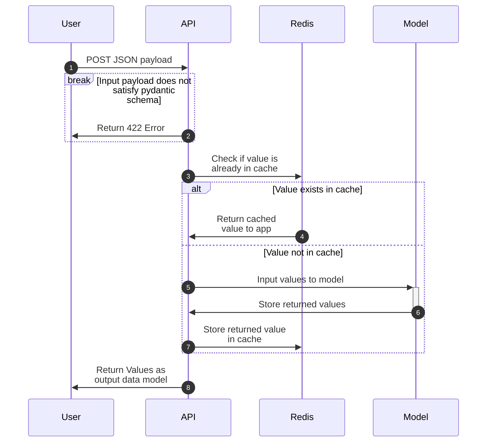
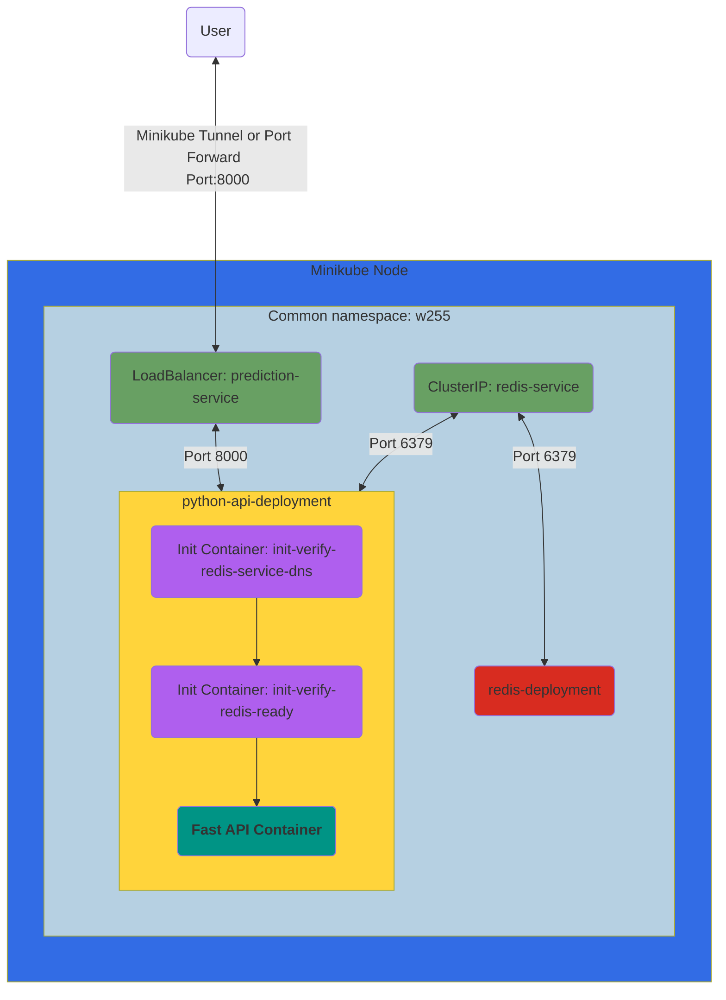

# Caching and Kubernetes

## Overview

-  API takes a *list* of inputs to predict instead of a single input.
-  API will have a rudimentary Redis cache for the new `/bulk-predict` endpoint based on the inputs.
-  Application deploys locally on a Kubernetes environment (Minikube).

### API Requirements

- [ ] Ensure the model is loaded only when the container is instantiated/started (i.e., not every time you run a prediction)
- [ ] Create a new request model which extends your single input model to accept a list of inputs instead of a single input.
  - Use `houses` as the field name which expects a list of the input objects you designed in lab2
- [ ] Create a response model returning a `list` of floats
- [ ] Create a new `POST` endpoint `/bulk-predict` which takes a `List` of inputs based on the request model you created above
  - You must utilize the `multi_predict` function we have defined for you in the template
  - Add the decorator key to this defined function
- [ ] Run your predictions on a matrix input instead of row by row. (See [Input Vectorization](#input-vectorization) for our expectations)
- [ ] Cache the entire input sent to `/predict` to Redis (See [Redis Expectations](#redis-expectations) for our expectations)
- [ ] Cache the entire input sent to `/bulk-predict` to Redis (See [Redis Expectations](#redis-expectations) for our expectations)
- [ ] Update your tests from `lab2` to give list inputs to your new endpoint

### Deployment Requirements

- [ ] Deploy your application to Kubernetes locally (Minikube)
  - [ ] (`namespace.yaml`) Deploy all components to a non-default `namespace` called `w255`
  - [ ] (`deployment-redis.yaml`) Deployment for Redis in `w255` namespace
    - See [Redis Expectations](#redis-expectations) for more details and requirements
  - [ ] (`deployment-pythonapi.yaml`) Deployment for your API in `w255` namespace
    - [ ] Your API deployment (`deplyoment-pythonapi.yaml`) should include an `initContainer`, `readinessProbe`, `livenessProbe`, and `startupProbe`
      - Init Containers:
        - [ ] Create an `initContainer` named `init-verify-redis-service-dns` should wait for the Redis DNS to become available
        - [ ] Create an `initContainer` named `init-verify-redis-ready` should wait for the Redis Service to become available
      - [ ] `readinessProbe` should wait for the API to be locally available by using the `/health` endpoint
      - [ ] `livenessProbe` should monitor whether the API is responsive by using the `/health` endpoint
      - [ ] `startupProbe` should wait for the API to be locally available by using the `/health` endpoint
    - [ ] Your API deployment should have `3` replicas
  - [ ] (`service-redis.yaml`) Service for Redis in `w255` namespace
  - [ ] (`service-prediction.yaml`) Service for API in `w255` namespace
    - It should be a [LoadBalancer](https://kubernetes.io/docs/concepts/services-networking/service/#loadbalancer) type

### API Diagram

The following is a visualization of the sequence diagram describing our new API

### Deployment Diagram

The following is a visualization of the infrastructure you should implement for Lab 3.

## Time Expectations

This lab will take approximately ~20 hours. Most of the time will be spent configuring Kubernetes, the deployment, and services, followed by testing to ensure everything is working correctly. Minimal changes to the API are required.
